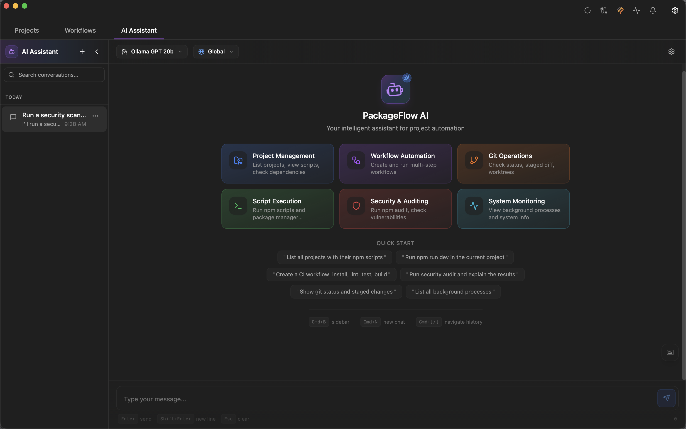

<p align="center">
  
</p>

<h1 align="center">Skillshare App</h1>

<p align="center">
  <strong>Your dotfiles, beautifully managed.</strong><br/>
  <sub>A desktop companion for the skillshare CLI — manage dotfiles, sync configurations, and let AI help via MCP.</sub>
</p>

<p align="center">
  <a href="https://github.com/runkids/skillshare-app/releases">
    
  </a>
  <a href="https://github.com/runkids/skillshare-app/stargazers">
    
  </a>
  <a href="https://github.com/runkids/skillshare-app/blob/main/LICENSE">
    
  </a>
  
</p>

<p align="center">
  
</p>

<p align="center">
  <a href="https://github.com/runkids/skillshare-app/releases"><strong>📥 Download</strong></a> •
  <a href="#-features"><strong>✨ Features</strong></a> •
  <a href="#-ai--mcp-integration"><strong>🤖 AI & MCP</strong></a> •
  <a href="#-documentation"><strong>📚 Docs</strong></a> •
  <a href="#-screenshots"><strong>📸 Screenshots</strong></a> •
  <a href="#-faq"><strong>❓ FAQ</strong></a>
</p>

---


<p align="center">
  
  <br/>
</p>

<p align="center">
  
</p>

<!-- TODO: Add a 20–40s product demo video link (YouTube/X) and/or a thumbnail image here. -->

---

## Why Skillshare App?

> **"Claude, sync my dotfiles across machines."**
> **"Show me what changed in my configs."**
> **"Switch to my work setup and apply those settings."**

**One app to manage dotfiles, track configurations, and keep everything in sync — across all your projects.**
**The killer feature? Your AI assistant can control it via MCP.**

| Before | After |
|--------|-------|
| Manually copying dotfiles between machines | One-click sync. Done. |
| Losing track of config changes | Visual diff, instant snapshots |
| "Where did I put that config?" | All dotfiles in one place |
| AI can only read your code | **AI manages your dotfiles, syncs configs, switches setups** |

Built with **Tauri + Rust** — fast, lightweight, 100% local.

## 🎬 Quick Start

```bash
# Install via Homebrew
brew tap runkids/tap && brew install --cask skillshare-app
```

Or [download directly](https://github.com/runkids/skillshare-app/releases) → Launch the app → Follow the onboarding wizard.

> 💡 Press <kbd>Cmd</kbd> + <kbd>K</kbd> for instant worktree switching

### Try It in 60 Seconds

1. Launch the app — it will detect or install the skillshare CLI
2. Choose your dotfiles scope (home directory or project-specific)
3. Run the initial sync to create your first snapshot
4. (Optional) Enable MCP so your AI tool can manage dotfiles for you

### Common Use Cases

- Dotfiles management with visual diff and snapshots
- Multi-project configuration management
- Git integration with worktree switching
- Keep configs in sync across machines
- "AI as teammate" via MCP tool calls (safe + permissioned)

---

## ✨ Features

<table>
<tr>
<td width="50%">

### 📁 Dotfiles Management
Track, sync, and manage your dotfiles — visually.

### 🔄 Multi-Project Support
Manage dotfiles per project or globally from your home directory.

### 🤖 CLI Wrapper
Full GUI for the skillshare CLI — no terminal needed.

### 🔀 Git Integration
Commit, branch, stash, diff — all visual, all easy.

</td>
<td width="50%">

### 🌳 Worktree Superpowers
See all worktrees, switch instantly, resume sessions.

### 🛡️ Security & Privacy
All data stays local. API keys encrypted with AES-256-GCM.

### ⌨️ Keyboard Shortcuts
Customizable shortcuts for power users.

### 🔧 AI-Powered
Multi-provider AI support with MCP integration.

</td>
</tr>
</table>

---

## 🤖 AI & MCP Integration

<p align="center">
  
  <br/>
  <em>AI generates commit messages from your diffs</em>
</p>

### Multi-Provider AI Support

| Provider | Type | Use Case |
|----------|------|----------|
| **OpenAI** | Cloud | Complex analysis |
| **Anthropic** | Cloud | Claude for intelligent commits |
| **Google** | Cloud | Gemini for fast responses |
| **Ollama** | Local | Privacy-first, unlimited |
| **LM Studio** | Local | Custom models, no API costs |

### MCP Server — Let AI Control Your Dev Environment

Skillshare App exposes a **Model Context Protocol (MCP) server** that AI assistants can use:

```
"Claude, sync my dotfiles and show what changed."
"List all my projects and their status."
"Switch to the payment-fix worktree and start working."
```

**Works with:**
- Claude Code
- Codex CLI
- Gemini CLI
- Any MCP-compatible AI tool

### What AI Actually Does (MCP Tool Chains)

Skillshare App is "AI-driven" because the AI can call real tools (not just generate text). Example flows:

**1) Understand a project**
- You: "List my projects and show the current status"
- Tools: `list_projects` → `get_project`

**2) Manage configurations**
- You: "Sync my dotfiles and summarize changes"
- Tools: `get_project` → `sync_dotfiles`

**3) Generate a commit message from staged changes**
- You: "Write a conventional commit message for what I staged"
- Tools: `get_git_diff` → (AI drafts message)

### MCP Setup (Copy/Paste)

Skillshare App ships a companion MCP server binary: `skillshare-mcp` (stdio transport).

In Skillshare App, open **Settings → MCP → MCP Integration** and copy the generated config for:
- **Claude Code / VS Code** (JSON)
- **Codex CLI** (TOML)

Then your AI tool can call actions like `list_projects`, `sync_dotfiles`, and more.

<p align="center">
  
</p>

### AI CLI Integration

Run AI commands directly from Skillshare App:

```
You: "Analyze the config changes and suggest improvements"
AI: Analyzing 3 modified configuration files...
```

**Security First:**
- All API keys encrypted with AES-256-GCM
- Permission levels: Read Only → Confirm → Full Access
- Fine-grained tool permissions
- Complete request logging

### Security & Privacy (Local-First)

Skillshare App is designed to keep your dotfiles and secrets on your machine.

- Data stays local; AI features are opt-in
- Keys/tokens encrypted at rest
- MCP is permissioned (read → confirm → full)

Read more: [Security & Privacy](./docs/security-and-privacy.md)

---

## 📚 Documentation

Documentation home: [English](./docs/README.md) • [繁體中文](./docs/zh-TW/README.md) • [简体中文](./docs/zh-CN/README.md)

<details>
<summary><strong>📖 Full Feature Documentation</strong></summary>

| Feature | Description |
|---------|-------------|
| [Getting Started](./docs/getting-started.md) | Installation and first steps |
| [Security & Privacy](./docs/security-and-privacy.md) | Local-first storage and permissions |
| [Troubleshooting](./docs/troubleshooting.md) | Common issues and fixes |
| [Project Management](./docs/features/project-management.md) | Import and manage projects |
| [One-Click Scripts](./docs/features/one-click-scripts.md) | Run scripts with live terminal |
| [Visual Workflow](./docs/features/visual-workflow.md) | Drag-and-drop automation |
| [Monorepo Support](./docs/features/monorepo-support.md) | Multi-project workspace integration |
| [Git Integration](./docs/features/git-integration.md) | Visual Git operations |
| [Worktree Management](./docs/features/worktree-management.md) | Quick worktree switching |
| [One-Click Deploy](./docs/features/one-click-deploy.md) | Deploy to Netlify/Cloudflare |
| [Security Audit](./docs/features/security-audit.md) | Vulnerability scanning |
| [Time Machine](./docs/features/time-machine.md) | Dependency snapshots & integrity |
| [AI Integration](./docs/features/ai-integration.md) | Multi-provider AI support |
| [MCP Server](./docs/features/mcp-server.md) | AI tool integration |
| [Webhooks](./docs/features/webhooks.md) | Incoming/outgoing automation |
| [Toolchain Management](./docs/features/toolchain-management.md) | Node.js version management |
| [Keyboard Shortcuts](./docs/features/keyboard-shortcuts.md) | Complete shortcut reference |

</details>

---


## 📸 Screenshots

<details open>
<summary><strong>🎯 Projects + Scripts</strong></summary>
<br/>

</details>

<details>
<summary><strong>🌳 Worktrees</strong></summary>
<br/>

</details>

<details>
<summary><strong>⚡ Visual Workflow Builder</strong></summary>
<br/>

</details>

<details>
<summary><strong>📦 Monorepo Support</strong></summary>
<br/>

</details>

<details>
<summary><strong>🔗 Dependency Graph</strong></summary>
<br/>

</details>

<details>
<summary><strong>🔀 Git Integration</strong></summary>
<br/>

</details>

<details>
<summary><strong>🛡️ Security Audit</strong></summary>
<br/>

</details>

<details>
<summary><strong>🚀 Deploy Accounts</strong></summary>
<br/>

</details>

<details>
<summary><strong>💻 Terminals</strong></summary>
<br/>

</details>

<details>
<summary><strong>🔌 Webhooks</strong></summary>
<br/>

</details>

<details>
<summary><strong>🧳 Worktree Sessions</strong></summary>
<br/>

</details>

<details>
<summary><strong>⌨️ Keyboard Shortcuts</strong></summary>
<br/>

</details>

## 📦 Installation

### Homebrew (Recommended)

```bash
brew tap runkids/tap
brew install --cask skillshare-app
```

#### Upgrade

```bash
brew update && brew upgrade --cask skillshare-app
```

#### Troubleshooting

If you see an error like `It seems the App source '/Applications/Skillshare App.app' is not there`:

```bash
# Force uninstall the old cask record
brew uninstall --cask --force skillshare-app

# Reinstall
brew install --cask runkids/tap/skillshare-app
```

### Direct Download

[Download the latest release](https://github.com/runkids/skillshare-app/releases) → Open the `.dmg` → Drag to Applications.

---

## 🗺️ Roadmap

### Recently Shipped

- [x] **Multi-Provider AI** — OpenAI, Anthropic, Google, Ollama, LM Studio
- [x] **MCP Server** — Let AI assistants control Skillshare App
- [x] **AI CLI Integration** — Claude Code, Codex, Gemini CLI
- [x] **Windows Support** — Cross-platform expansion
- [x] **Notification Center** — Background task monitoring
- [x] **System Theme** — Auto light/dark mode

### Coming Soon

- [ ] 🐧 **Linux Support** — Complete desktop coverage
- [ ] 📦 **Plugin System** — Community extensions
- [ ] 🔄 **MCP Actions** — Custom AI-triggered workflows
- [ ] 🌐 **Remote Collaboration** — Team config sharing

> 💡 [Request a feature](https://github.com/runkids/skillshare-app/issues) or vote on existing ones!

## ❓ FAQ

<details>
<summary><strong>What is skillshare?</strong></summary>
<br/>

**skillshare** is a CLI tool for managing dotfiles and configurations. Skillshare App is the desktop companion that provides a visual interface for skillshare CLI operations, plus AI integration via MCP.

</details>

<details>
<summary><strong>Is my data safe?</strong></summary>
<br/>

**100% local-first.**

- All data stays on your machine
- API keys encrypted with AES-256-GCM
- No tracking, no telemetry
- AI features are opt-in
- MCP permissions are granular

</details>

<details>
<summary><strong>What AI providers are supported?</strong></summary>
<br/>

**Cloud:** OpenAI, Anthropic (Claude), Google (Gemini)
**Local:** Ollama, LM Studio — unlimited, private, free

Use local models for sensitive configs. Use cloud for convenience.

</details>

<details>
<summary><strong>What is MCP and why should I care?</strong></summary>
<br/>

**Model Context Protocol (MCP)** is how AI assistants talk to tools.

With Skillshare App's MCP server:
- Claude Code can manage your dotfiles
- AI can sync configurations across projects
- Voice-controlled development becomes possible

It's like giving AI hands to help you manage configs.

</details>

## 🛠 Development

### Prerequisites

- Node.js 18+
- Rust 1.70+
- pnpm

### Setup

```bash
# Clone the repository
git clone https://github.com/runkids/skillshare-app.git
cd skillshare-app

# Install dependencies
pnpm install

# Start Vite (web UI)
pnpm dev

# Start the desktop app
pnpm dev:tauri
```

### Build

```bash
# Build web assets
pnpm build

# Build the desktop app (dmg)
pnpm build:tauri
```

## 🤝 Contributing

We welcome contributions! Please see our [Contributing Guide](CONTRIBUTING.md) for details.

### Ways to Contribute

- 🐛 Report bugs and request features via [Issues](https://github.com/runkids/skillshare-app/issues)
- 🔧 Submit pull requests for bug fixes or new features
- 📝 Improve documentation
- 🔄 Share your configuration templates

### Development Guidelines

1. Fork the repository
2. Create a feature branch (`git checkout -b feature/amazing-feature`)
3. Commit your changes (`git commit -m 'Add amazing feature'`)
4. Push to the branch (`git push origin feature/amazing-feature`)
5. Open a Pull Request

---

## 🙏 Acknowledgments

Built with amazing open-source tools:

[Tauri](https://tauri.app/) • [React Flow](https://reactflow.dev/) • [Lucide](https://lucide.dev/) • [Claude Code](https://claude.ai/code)

---

<p align="center">
  <a href="https://star-history.com/#runkids/skillshare-app&Date">
    
  </a>
</p>

---

<p align="center">
  <strong>If Skillshare App saves you time, give us a star!</strong><br/><br/>
  <a href="https://github.com/runkids/skillshare-app">
    
  </a>
</p>

<p align="center">
  <sub>MIT License • Made by <a href="https://github.com/runkids">runkids</a></sub>
</p>
